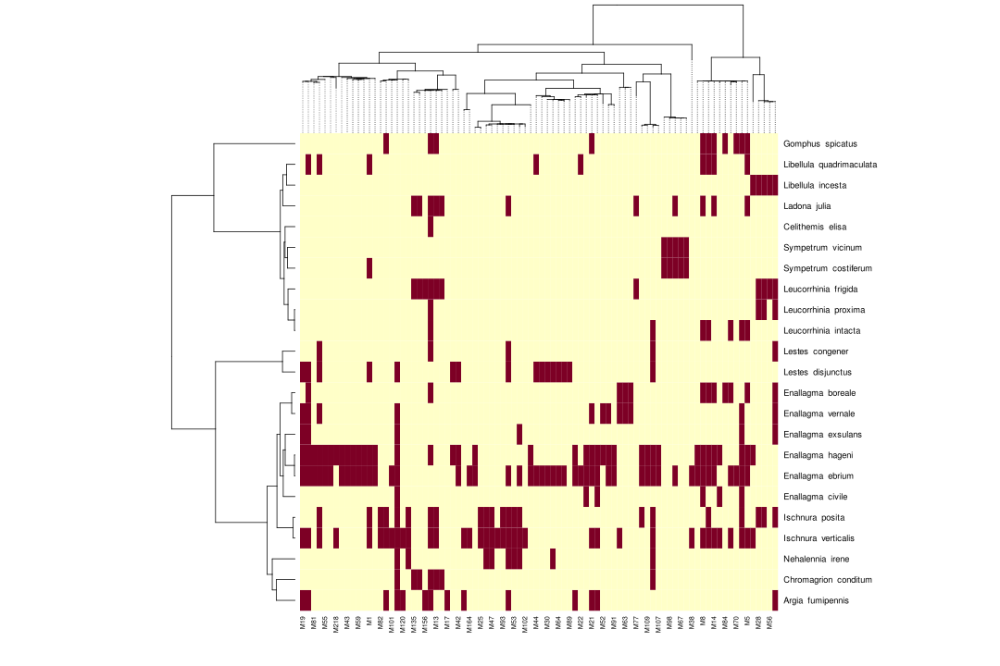
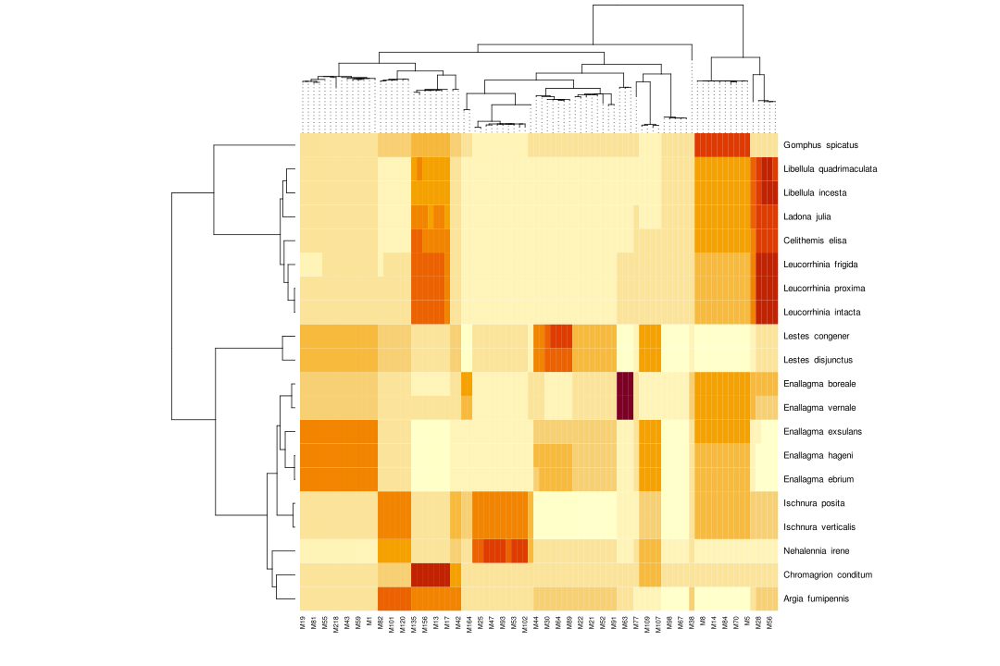

```{r setup, include=FALSE}
knitr::opts_chunk$set(echo = FALSE)
knitr::opts_chunk$set(warning = FALSE)
knitr::opts_chunk$set(message = FALSE)
knitr::opts_chunk$set(results = FALSE)
options(digits = 2, scipen = -1)
```

# Methods

## Odonate sampling

We collected odonate specimens from 83 sites [(map 1)](#figures) across Québec
in the summers of 2015, 2019, and 2020. We found specimens with mites at 29 of
these sites. Specimens from all years were weighed, inspected under microscope
for mites, and had their mites counted.

These specimens come from previous projects which did not all use the same
sampling methodology. As such only a subset of our data gives us abundance and
community composition data. The odonates from 2015 were the same used for
@arrowsmith2018 and @loscerbo2020 and were collected according to a standardized
sampling protocol. At each site, a 1 km long transect along the sunniest shore
of the site was established, each consisting of 10 stations 20m x 20m in size
and spread 100 m apart. Someone spent 10 minutes walking each station, catching
everything present (specimen handling time was not included)
@loscerbo2020. This provides relative abundance data for each site. Here, we are
using the sum of these measurements from every 2015 site as a measure of
relative species abundance. We have abundance data from all but three (of the
27) species included in our analysis. We have no abundance data from the sites
sampled in 2019 and 2020 as we used simple opportunistic sampling here.

Since most odonate specimens were not collected with DNA preservation in mind,
we did not preserve all specimens in the same way. Those from 2015 were immersed
in 95% ethanol for 12-24 hours and were then removed and allowed to air dry;
they remained in envelopes for the next 5 years until we removed their mites
[@loscerbo2020]. Those from 2019 were doused with acetone, allowed to air dry
and then stored in envelopes for a year before we removed their mites. Those
from 2020 were treated the same way as those from 2019 but only stored for a few
weeks. One sample from 2020 was stored immediately in 95% ethanol until its
mites were removed. Regardless of preservation method, we were able to
successfully extract and sequence DNA from all our samples.

## Immune response measurement

When an adult was caught, it was placed in a manila envelope to be brought back
to the lab. Individuals spent no more than 2 hours in an envelope from the time
they were caught to the moment they were placed in 11 cm^3 mesh boxes to
acclimate. Studies have suggested different amounts of time to allow odonates to
acclimate (Combes et al., 2012; Wetzel & Likens, 2000). We allowed 30 minutes at
room temperature with full natural lighting (and all lights turned on in lab)
before beginning the experiment. Boxes containing adult individuals were kept at
constant room temperature (~20-23 °C) throughout the experiment because
literature has shown that invertebrates vary in their immune response as a
result of temperature (Linder et al., 2008; Murdock et al., 2012).

Odonates are capable of mounting a melanotic immune response, creating a barrier
between the hemolymph and the mite’s stylostome out of dark-brown melanin
(González-Santoyo & Córdoba-Aguilar, 2012). By quantifying the darkness of a
proxy that has been inserted and melanized within a live odonate (to simulate
mite feeding tube), we can determine the relative strength of its immune
response (Ilvonen & Suhonen, 2016).

A 3 mm long sterile white nylon filament (hereafter implant) was inserted into
the venter of the odonate thorax to simulate a mite feeding tube; this is where
mites tend to latch onto their host (Mlynarek et al., 2015; Nagel et al., 2011).
Odonates were returned to their box with only a wet paper towel for 12 hours to
allow the immune response to proceed. Odonates were subjected to their typical
photoperiod, meaning they were subjected to natural, and no artificial,
lighting. After 12 hours the implant was removed and immediately photographed.
Implants were photographed from a tripod ~20 cm directly above using a Canon EOS
Rebel T6s equipped with a MP-E 65mm lens. In 2019, photos were taken using the
flash of the camera as the main source of light for the photo. In 2020 we
supplemented the camera flash with an Amscope HL150-AY 150W Fiber Optic Dual
Gooseneck Microscope Light Illuminator set at max. The lights were positioned to
shine lengthwise of the filament. We also positioned a Yongnuo Professional
Flash Speedlight Flashlight YN 560 III (settings at default) 80 cm from the
filament, shining the light perpendicular to the long side of the implant.
Odonates were then drowned in acetone, dried, and stored in glassine envelopes
for later identification and mite counts.

Using ImageJ the images of nylon inserts were converted to 8-bit greyscale,
resulting in darkness values ranging from 0 to 255 (0 being black and 255
white), which represent the amount of melanin deposited and therefore immune
response. To standardize the analysis between images we measured the average
darkness of a square aligned to the implant with one edge positioned just below
the point of the cuticle. The square had edge lengths equal to the width of the
implant (0.4 mm) and hence any melanin deposit which hung of the side of the
implant was not included. All darkness measurements were scaled to be between 0
and 1.

## DNA extraction and sequencing

We removed mites under a dissecting scope and pooled them into autoclaved
microtubes by species and by site, such that at each site, we prepared one
sample per odonate species which had parasites. We only pooled the 2015
specimens by species and not by site. In our analysis, we combined samples which
were pooled at the site level, and analyzed data only at the host species level.

Except for samples 1 through 5 which were a trial run, mites were stored in 95%
ethanol before DNA extraction. The longest any sample spent between mite removal
and DNA extraction was three months. To remove the ethanol in preparation for
DNA extraction the microtubes were uncovered under a fume-hood and the ethanol
was allowed to evaporate overnight.

We extracted DNA from mite samples using Qiagen’s DNEasy Blood and Tissue Kit.
The extractions were performed according to the manual except that two 2.3 mm
stainless steel beads (BioSpec Products) were added to each tube to increase
cell disruption. During the lysis step the samples were removed from their heat
bath and vortexed for 5 minutes at a time for a total of 30 minutes over a
3-hour long digestion. The first 5 samples were a trial run, these were put in a
bead mill for 2 minutes rather than using the vortex. One batch (samples 1-16)
was also vortexed for 30 minutes before being put into the heat bath. Once in
the heat bath, this batch was vortexed only occasionally as per the
manufacturer's instruction for a few seconds at a time to agitate the material.
Five negative control samples were also used to detect potential
cross-contamination. Samples were randomly assigned to batches for DNA
extraction to ensure that any cross-contamination that occurs during the next
steps is randomly distributed and would cause no bias to the results. All DNA
samples were then stored in a -80C freezer until the next steps.

A 350 base pair segment of Cytochrome Oxidase I was amplified using a MICOInt
forward primer [@leray2013] and a Fold reverse primer [@arribas2016]. This is a
region of the mitochondrial genome commonly used for DNA barcoding in animals.
All samples, including negative controls were amplified and sequenced on an
Illumina Miseq at the Université du Québec à Montréal CERMO-FC Genomics Platform
using the MiSeq reagent kit v3 (2 x 300 cycles; Illumina).

## Sequence preparation and network construction

The raw sequence data was prepared and chimeric sequences removed using `DADA2`
version 1.18.0 [@callahan2016]. Both forward and reverse reads had 26
nucleotides trimmed from the beginning of the sequence to remove primers.
Sequences were dereplicated and ASVs (unique amplicon sequence variants)
inferred. Forward and reverse reads were merged with a minimum overlap of 10
nucleotides. Unless otherwise stated, the default settings from `DADA2` were
used.

`DADA2` was also used to assign taxonomy to all the samples. Since there is no
established reference database for assigning mite taxonomy we created our own
using all of the Arachnid and Odonate sequences stored in the BOLD database as
of September 2020 as well as BOLD's taxonomic information [@ratnasingham2007].
Any non-mite sequences were filtered out on the basis of these taxonomy
assignments.

Rarefying read count data has been shown to throw away more data than necessary
[@mcmurdie2014]. Samples can vary a large degree from each other in terms of
total read count as such rarefying sequence count data will throw away a lot of
data (any counts below the rarefaction threshold) from samples with smaller
total numbers of reads. Instead, we used a variance stabilizing transformation
from the `DESEq2` package [@anders2010]. Similarly to rarefaction, this should
remove sequences from samples when they have very few reads, sequences likely to
be contaminants. Any ASV which still showed any abundance in a sample after
transformation was counted as a detection of an interaction. All of the control
samples showed no detections after this step except for a single positive
detection in a PCR control. Finally, we removed any samples which had more mite
sequence detections than there were mites in the sample.

We created a simple bipartite binary network since we have too few replicates of
many species to confidently place probabilistic weights on the interactions.
Interactions in this network correspond to positive detections of a mite ASV in
a sample from an odonate species. We excluded any mites recorded as interacting
only with a single host species from the network as it is impossible to know if
this is truly a high degree of specialization or simply a very rare mite. The
final network included 27 odonate species, 88 mite ASVs, and 358 interactions.

## Inferring the mite phylogeny

Alignment using MUSCLE and inferring ML tree using `phangorn`

## Modelling the parasite-host interactions

We used Generalized Additive Models (GAMs) from the `mgcv` package [@wood2017]
to model the relationships between odonates and water mites. The phylogenies
were represented using the Markov Random Field (MRF) basis provided in the
`mgcv` package (Pedersen, personal communication). A MRF is a graphical model
representing the relationships between many random variables, where neighbouring
variables are conditionally independent of all other variables in the graph.
[@rue2005] This applies well to many models of trait evolution on phylogenies;
nodes which are connected by an edge are assumed to be more alike than nodes
which are separated by many edges. A penalty matrix represents the relationships
between nodes according to edge lengths in the phylogeny, where non-zero entries
in the matrix indicate a relationship between two nodes. The penalty matrix is
the inverse of the covariance matrix given by a Brownian motion model of trait
evolution on the phylogeny [@felsenstein1973].

We fit a model predicting the probability of interaction between every mite and
every odonate species using our data of detections of a mite in odonate samples.
As predictors we included both the odonate phylogeny, the mite phylogeny, their
interaction and the log average strength of the odonate species immune response.

## Examining the pattern of specialization accross the odonate phylogeny.

To express the degree to which mites are phylogenetic specialists on their host
we used the standardized effect size of the mean pairwise phylogenetic distance
between the host species of a mite, weighted by the probability of interaction
predicted by our co-phylogenetic GAM model. Simply using the mean phylogenetic
distance between hosts would leave the measure vulnerable to bias caused by the
fact that we would expect mites with very few hosts to have hosts which are more
closely related than the hosts of mites with more hosts by chance alone. The
standardized effect size corrects for this by comparing the observed mean
phylogenetic distance to what we would expect under a null model where the same
number of host species are randomly chosen from the sample pool 999 times. Both
the mean phylogenetic distance and the standardized effect size of it are
calculated using the R package `picante` [@kembel2010].

To assess weather the distribution of specialists and generalists changes across
the host phylogeny we fit another GAM using `mgcv`. In this model we predicted
the difference between the median standardized effect size and the fifth
percentile standardized effect size of pairwise phylogenetic distance in the
parasite community for each host. This measure shows us how narrow or how wide
of a range of specialization strategies there is on different host species. We
used the host phylogeny and the log immune response as the predictors.

# Results


## Reconstruction of interaction network

Fig 2

## Modelling of interactions

Fig 3

```{r}
source("scripts/co-phylogenetic_gam.r")

cps <- summary(co_phylo_model)
cpt <- as_tibble(cps$s.table)
cptl <- as_tibble(cps$p.table)

ims <- summary(immune_model)
imss <- as_tibble(ims$s.table)
imsp <- as_tibble(ims$p.table)

ic <- summary(immune_cons)

```

|Smooth terms            |Reference df     |Effective df  |Chi-squared      |P-value              |
|:-----------------------|:----------------|:-------------|:----------------|:--------------------|
|Odonate Phylogeny       |`r cpt$Ref.df[1]`|`r cpt$edf[1]`|`r cpt$Chi.sq[1]`|$< 2 \times 10^{-16}$|        
|Mite Phylogeny          |`r cpt$Ref.df[2]`|`r cpt$edf[2]`|`r cpt$Chi.sq[2]`|$< 2 \times 10^{-16}$|
|Mite-Odonate Interaction|`r cpt$Ref.df[3]`|`r cpt$edf[3]`|`r cpt$Chi.sq[3]`|$< 2 \times 10^{-16}$|

|Linear terms        |Estimate            |Standard Error          |Chi-squared          |P-value                 |
|:-------------------|:-------------------|:-----------------------|:--------------------|:-----------------------|
|Intercept           |`r cptl$Estimate[1]`|`r cptl$"Std. Error"[1]`|`r cptl$"z value"[1]`|$`r cptl$"Pr(>|z|)"[1]`$|        
|Log immune response |`r cptl$Estimate[2]`|`r cptl$"Std. Error"[2]`|`r cptl$"z value"[2]`|$`r cptl$"Pr(>|z|)"[2]`$| 

Note that a species' immune response is very phylogenetically conserved in
odonates (R^2^~adj~ = `r ic$r.sq`). As such the effect of immune response and
the odonate phylogeny are highly confounded in this model. Another model which
excludes terms related to the odonate phylogeny as predictors speaks to the
significance immune response actually has in modelling these interactions.

|Smooth terms            |Reference df      |Effective df    |Chi-squared         |P-value              |
|:-----------------------|:-----------------|:---------------|:-------------------|:--------------------|
|Mite Phylogeny          |`r imss$Ref.df[1]`|`r imss$edf[1]`|`r imss$Chi.sq[1]`|$< 2 \times 10^{-16}$|

|Linear terms        |Estimate            |Standard Error          |Chi-squared          |P-value                 |
|:-------------------|:-------------------|:-----------------------|:--------------------|:-----------------------|
|Intercept           |`r imsp$Estimate[1]`|`r imsp$"Std. Error"[1]`|`r imsp$"z value"[1]`|$`r imsp$"Pr(>|z|)"[1]`$|
|Log immune response |`r imsp$Estimate[2]`|`r imsp$"Std. Error"[2]`|`r imsp$"z value"[2]`|$`r imsp$"Pr(>|z|)"[2]`$| 

Both the complete model and the reduced model show a detectable negative
correlation between the probability of mite interactions with an odonate and the
strengths of that odonate species' immune response. Hosts with strong immune
responses constitute a harsher environment for water mites.

## Differences in sepecialization distribution

```{r}
source("scripts/specialization_gam_models.r")

im <- summary(immune_model)
imp <- as_tibble(im$p.table)

```

Using predicted data from the complete model we just presented we next examine
the distribution of generalist specialist strategies on different odonate host
species (Fig 4). This model predicts the difference between the 5th percentile
and the median of specialization in an odonate species' parasite community.
Since the predicted network is probablistic and has every mite interacting with
every odonate, the specialization values are weighted by the interaction
probability between each mite and ododnate pair.

|Linear terms        |Estimate           |Standard Error         |Chi-squared         |P-value                |
|:-------------------|:------------------|:----------------------|:-------------------|:----------------------|
|Intercept           |`r imp$Estimate[1]`|`r imp$"Std. Error"[1]`|`r imp$"t value"[1]`|$`r imp$"Pr(>|t|)"[1]`$|
|Log immune response |`r imp$Estimate[2]`|`r imp$"Std. Error"[2]`|`r imp$"t value"[2]`|$`r imp$"Pr(>|t|)"[2]`$| 

The model shows there to be a significant negative correlations between the strength
of a species immune response and how specialist its parasite community is.

# Figures


Map 1


Fig 2


Fign 3


Fig 4


# References
