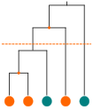

```{r setup, include=FALSE}
knitr::opts_chunk$set(echo = FALSE)
knitr::opts_chunk$set(warning = FALSE)
knitr::opts_chunk$set(message = FALSE)
knitr::opts_chunk$set(results = FALSE)
options(digits = 2, scipen = -2)
```

<div class = "title_page">
  <div class = "title">
  Phylogenetic scale of parasitic water mite specialization in the order Odonata
  </div>
  <div class = "author_line">
  Jacob K. Harvey
  <div class = "info_line">
  BIOL 490: Independent Study, Fall-2020 Winter-2021<br />Concordia University
  </div>
  </div>
  <div class = "info_line">
  Supervised by: <div>Dr Eric Pedersen</div>
  </div>
  <div class = "info_line">
  Committee: <div>Dr Jean-Philippe Lessard & Dr David Walsh</div>
  </div>
</div>

<div class = "abstract_page">
  <h1>Abstract</h1>
  
  Specialization is an essential concept for describing the ecology of any
  species, especially of parasitic species. Being obligately dependent on
  their host species to complete their lifecycle we would expect host traits
  to exert strong selective pressures on parasites and determine the degree
  to which they specialize on their hosts. Yet, there has been relatively
  little research on how host traits determine how specialized their parasites
  become, especially on insect hosts. Here, we use COI sequencing and
  reconstruction of the host-parasite interaction network to test the 
  hypothesis that high host abundance and low host mass should lead to 
  specialization of the associated parasites in an odonate-water mite system. 
  We show that on small and abundant hosts, like damselflies, water mites are
  more specialist, their hosts are grouped at narrower phylogentic scales.
  On larger and less abundant hosts, like dragonflies, parasites specialize
  at broader phylogenetic scales.

</div>


# 1	Introduction

Specialization, the process by which organisms limit themselves to a part of
some niche dimension, is an important unifying concept in ecology [@poisot2011;
@futuyma1988]. Every organism needs some sort of resource to survive and as 
such can be placed somewhere on the spectrum of resource specialization.
Resource specialization often plays important ecological roles such as promoting
coexistence and maintaining biodiversity. Competing species can coexist by
specializing on different subsets of the resources they compete over. The 
Janzen-Connell hypothesis, widely, believed to explain high tropical tree 
diversity, depends on specialist enemies accumulating in the region around
adult trees, reducing recruitment rates and suitable areas for dominant
species [@janzen1970; @connell1971].

Many organisms, and especially parasites, will exhibit strong phylogenetic 
signal in the resources they use. They utilize a set of related hosts, and will
often be less successful on hosts the more distant the relation to their primary
host [@perlman2003; @poulin2011; @krasnov2004]. Specialization can simply be 
expressed as the number of hosts a parasite exploits, but the phylogenetic 
relationships between the hosts adds another dimension. A parasite exploiting 
two closely related hosts is more specialist than a parasite exploiting two 
distantly related hosts [@poulin2005]. To address this, indices of the 
phylogenetic diversity of a parasite's hosts are widely used to express 
their degree of specialization accounting for the phylogentic relationships
between host species [@poulin2011]. 

Phylogenetic scale also becomes an important consideration when considering 
parasites whose host choice is phylogenetically determined (see @graham2018). 
In this use case, it is conceptually very similar to phylogenetic diversity 
indices. It expresses how narrow or how broad of a collection of hosts are. 
Phylogenetic scale can be a much more intuitive way of expressing this 
than diversity indices. Indices often are scaled to a number between zero and 
one, or otherwise simply don't have values which have intuitive meaning. A 
measure of phylogenetic scale can take on natural units which have an intuitive
link to the phylogeny, such as an expression how many millions of years of 
evolutionary history explain the current host community of a parasite. This
also makes comparisons between different studies easier, since the values 
can be expressed on a common scale of evolutionary time span.

Given that parasites show phylogenetic signal in their host choice, we know
that this must be due to host traits, often phylogenetically conserved, which
affect parasite adaptations to the host. There is evidence of many host traits
which affect the degree to which a parasite becomes specialist or generalist
on their hosts. One such pattern which is thought to be robust is that host 
species with unstable population dynamics tend to have more generalist 
parasites as specialist parasites would be at a very high risk of extinction
when the population size dips too low [@bush1994]. As such, species which occur
in low abundance should host less specialist parasites. We might also expect 
this relationship to hold with mass as small organisms tend to be more abundant
than large organisms [@lewis2008]. In contrast, the argument has also been made
for the opposite relationship, that large organisms should host more specialist
parasites. The argument being that they generally live longer and serve as more
reliable resources [@poulin2007a]. This argument might not hold in general, 
especially when dealing with non-vertebrate hosts such as insects which are 
short-lived in general.

Speciose lineages are also thought to host more generalist parasites than more
species poor lineages [@poulin2007a]. Parasites tend to be less successful on 
hosts the more distantly related they are to hosts which they already are
adapted to [@perlman2003; @krasnov2004; @poulin2011]. With few closely related
potential hosts, the much reduced success rate on new hosts may be prohibitive
and parasites may be unable to adapt. With many closely related host species
a parasite can colonize a new host species with a relatively smaller reduction
in success rate, making it more likely they can adapt to a new host. The many
related species of a speciose lineage create a bridge allowing parasites to 
easily adapt to new hosts, and become more generalist. An example of this is
provided by @poulin2007a who showed that among 41 genera of ectoparasites and
90 genera of endoparasites on Canadian freshwater fish, genera which
parasitized more speciose fish families tended to be more generalist.

Finally, host defences should have an effect on the degree to which their 
parasites specialize. Weak host defences should allow parasites to be successful
on a host with only minimal adaptation therefore allowing success on a wide 
range of hosts. This is akin to pattern expected with the species richness of a
host lineage. Weak host defences mitigate the reduction in success rate 
parasites experience on new host species. Strong host defences, by contrast, 
would create an antagonistic convolution situation in which parasites would 
need to specialize to a greater degree to remain successful on hosts with 
stronger defences. @moller2005 found that, in birds, species with weak immune 
responses hosted only generalist fleas while birds with strong immune systems 
hosted both generalists and specialists. This pattern has also been observed 
for flatworms which parasitize freshwater fish whereby the most specialist 
worms were found in the most immunologically active fish tissues and generalist
worms were found in tissues with weak immune activity [@locke2010].

Given the relative simplicity of studying host-parasite relationships, there 
has been much work in this area, though mostly on vertebrate hosts. Much less 
work has been done on insect hosts [@mlynarek2015]. The order Odonata provides
an ideal system for studying host-parasite interactions on insect hosts.
They are abundant, widespread, and have a relatively simple and stable taxonomy.
They are commonly parasitized by larval water-mites (Hydrachnidia) mostly from
the genus *Arrenurus*. These mites are difficult to identify morphologically,
but DNA barcoding has been used instead [@mlynarek2015; @mlynarek2013; 
@mlynarek2015a; @asadi2012]. Odonata also consists of two major suborders 
(dragonflies and damselflies) which contrast in a number of the host traits
possibly affecting parasite specialization which we have discussed. Dragonflies
are generally larger than damselflies and are generally present in lower local
abundance. Dragonflies also tend to have stronger defences than damselflies; 
their cuticles are thicker and they have stronger immune responses [@blondeau].

There has been much previous research on patterns of intensity of water-mite 
parasitism in Odonata, much less is known about how specialized these mites 
are and what lineages of odonates host the most specialized parasites 
[@loscerbo2020; @mlynarek2015]. The contrast between the two suborders would 
lead us to expect a difference in selective pressures for parasites in each
group. We will test the hypothesis that greater host abundance (and lower
mass) lead to more specialist parasites. On the basis of this hypothesis we
would predict that in Odonata, the damselflies would host more specialist
parasites. This implies that we also test the hypothesis that there is a 
difference in parasite specialization between dragonflies and damselflies.
This is suggested by the higher parasite intensity in damselflies shown by
@loscerbo2020 and research relating the abundance of a parasite to how
specialized it is [@krasnov2004; @poulin1998; @pinheiro2016].

# 2	Methods

## 2.1	Odonate sampling

We collected odonate specimens from 83 sites (map 1) across 
Québec in the summers of 2015, 2019, and 2020. We found specimens with mites
at 29 of these sites. Specimens from all years were weighed, inspected under 
microscope for mites, and had their mites counted. 

These specimens come from previous projects which did not all use the same
sampling methodology. As such only a subset of our data gives us abundance and
community composition data. The odonates from 2015 were the same 
used for @arrowsmith2018 and @loscerbo2020 and were collected according to a 
standardized sampling protocol. At each site, a 1 km long transect along the
sunniest shore of the site was established, each consisting of 10 stations
20m x 20m in size and spread 100 m apart. Someone spent 10 minutes walking each 
station, catching everything present (specimen handling time was not included) 
@loscerbo2020. This provides relative abundance data for each site. Here, we are
using the sum of these measurements from every 2015 site as a measure of
relative species abundance. We have abundance data from all but three (of the 
27) species included in our analysis. We have no abundance data from the sites
sampled in 2019 and 2020 as we used simple opportunistic sampling here.

Since most odonate specimens were not collected with DNA preservation in mind,
we did not preserve all specimens in the same way. Those from 2015 were 
immersed in 95% ethanol for 12-24 hours and were then removed and allowed to 
air dry; they remained in envelopes for the next 5 years until we removed their 
mites [@loscerbo2020]. Those from 2019 were doused with acetone, allowed to air 
dry and then stored in envelopes for a year before we removed their mites. 
Those from 2020 were treated the same way as those from 2019 but only stored for
a few weeks. One sample from 2020 was stored immediately in 95% ethanol until 
its mites were removed. Regardless of preservation method, we were able to
successfully extract and sequence DNA from all our samples.

## 2.2	DNA Extraction and sequencing

We removed mites under a dissecting scope and pooled them into autoclaved 
microtubes by species and by site, such that at each site, we prepared one 
sample per odonate species which had parasites. We only pooled the 2015 
specimens by species and not by site. In our analysis, we combined samples 
which were pooled at the site level, and analyzed data only at the host species
level.

Except for samples 1 through 5 which were a trial run, mites were stored in 95%
ethanol before DNA extraction. The longest any sample spent between mite removal
and DNA extraction was three months. To remove the ethanol in preparation for
DNA extraction the microtubes were uncovered under a fume-hood and the ethanol
was allowed to evaporate overnight.

We extracted DNA from mite samples using Qiagen’s DNEasy Blood and Tissue Kit. 
The extractions were performed according to the manual except that two 2.3 mm 
stainless steel beads (BioSpec Products) were added to each tube to increase 
cell disruption. During the lysis step the samples were removed from their heat
bath and vortexed for 5 minutes at a time for a total of 30 minutes over a 
3-hour long digestion. The first 5 samples were a trial run, these were put in a
bead mill for 2 minutes rather than using the vortex. One batch (samples 1-16) 
was also vortexed for 30 minutes before being put into the heat bath. Once in 
the heat bath, this batch was vortexed only occasionally as per the 
manufacturer's instruction for a few seconds at a time to agitate the material. 
Five negative control samples were also used to detect potential 
cross-contamination. Samples were randomly assigned to batches for DNA 
extraction to ensure that any cross-contamination that occurs during the next 
steps is randomly distributed and would cause no bias to the results. All DNA 
samples were then stored in a -80C freezer until the next steps.

A 350 base pair segment of Cytochrome Oxidase I was amplified using a MICOInt 
forward primer [@leray2013] and a Fold reverse primer [@arribas2016]. This is a
region of the mitochondrial genome commonly used for DNA barcoding in animals. 
All samples, including negative controls were amplified and sequenced on an 
Illumina Miseq at the Université du Québec à Montréal CERMO-FC Genomics 
Platform using the MiSeq reagent kit v3 (2 x 300 cycles; Illumina).

## 2.3	Sequence preparation and network construction

The raw sequence data was prepared and chimeric sequences removed using DADA2 
version 1.18.0 [@callahan2016]. Both forward and reverse reads had 26 
nucleotides trimmed from the beginning of the sequence to remove primers.
Sequences were dereplicated and ASVs (unique amplicon sequence variants) 
inferred. Forward and reverse reads were merged with a minimum overlap of
10 nucleotides. Unless otherwise stated, the default settings from 
DADA2 were used.

DADA2 was also used to assign taxonomy to all the samples. Since there is no
established reference database for assigning mite taxonomy we created our own
using all of the Arachnid and Odonate sequences stored in the BOLD database as
of September 2020 as well as BOLD's taxonomic information [@ratnasingham2007].
Any non-mite sequences were filtered out on the basis of these taxonomy 
assignments.

Rarefying read count data has been shown to throw away more data than necessary
[@mcmurdie2014]. Samples can vary a large degree from each other in terms of 
total read count as such rarefying sequence count data will throw away a lot of
data (any counts below the rarefaction threshold) from samples with smaller
total numbers of reads. Instead, we used a variance stabilizing transformation 
from the DESEq2 package [@anders2010]. Similarly to rarefaction, this should
remove sequences from samples when they have very few reads, sequences likely
to be contaminants. Any ASV which still showed any abundance in a sample after
transformation was counted as a detection of an interaction. All of the control
samples showed no detections after this step except for a single positive 
detection in a PCR control. Finally, we removed any samples which had more
mite sequence detections than there were mites in the sample.

We created a simple bipartite binary network since we have too few replicates 
of many species to confidently place probabilistic weights on the interactions. 
Interactions in this network correspond to positive detections of a mite ASV in
a sample from an odonate species. We excluded any mites recorded as interacting
only with a single host species from the network as it is impossible to know if
this is truly a high degree of specialization or simply a very rare mite. The 
final network included 27 odonate species, 88 mite ASVs, and 358 interactions.

## 2.4	Determination of phylogenetic scale

The phylogenetic scale of a mite represents the depth in the host's phylogenetic
tree where host identity is best predicted. It takes on the same units as the
branch lengths of the tree. As this method requires an ultrametric tree, this 
is normally time. In the case of this analysis, millions of years of 
evolutionary history.

This is calculated as the phylogenetically weighted Simpson's diversity
calculated on the presence/absence data of each mite's host community 
[@rao1982]. When an ultrametric phylogeny is used, as we are, this gives the 
mean branch length, in whatever units the tree uses, to the most recent common 
ancestor of any pair of species in the community. Since we are using a 
time-tree this can be interpreted as the expected age of the most recent common 
ancestor of any randomly selected pair of host species as illustrated in 
figure 2. In other words, this expresses the phylogenetic breadth of a mite's
host community

This method is better than simply using the most recent common ancestor of all
host species as an indication of the phylogentic breadth of a parasite because
that would be very susceptible to sample contamination or to rare observations
on an incidental host. A detection of a mite interaction with a species 
distantly related to its other hosts would cause a large shift in the resultant
scale of that mite.

## 2.5 Statistical analyses

To show that different odonate lineages differ in the balance of specialist and
generalist parasites that they host, we classified each mite as either a
specialist or a generalist. Those with phylogenetic scales of greater than 100
Ma are generalist and those less than 100 Ma are specialist. In the odonate 
phylogeny this roughly corresponds to a division at approximately the family
level. We chose this value because there is a natural gap in the distribution
of phylogenetic scales at around this value imposed by long branches in the
phylogeny. To test how sensitive the analysis is to our choice of phylogentic 
scale for classifying mites as specialist or generalist we re-ran the models 
using different values for the cutoff (25 Ma, and 50 Ma) to ensure all 
the results remain significant.

We used Generalized Additive Models (GAMs) from the `mgcv` package [@wood2017]
to do phylogenetic regression. The phylogeny was represented using the Markov
Random Field (MRF) basis provided in the package (Pedersen, personal 
communication). A MRF is a graphical model representing the relationships
between many random variables, where neighbouring variables are conditionally
independent of all other variables in the graph. [@rue2005] This applies well
to many models of trait evolution on phylogenies; nodes which are connected by
an edge are assumed to be more alike than nodes which are separated by many 
edges. A penalty matrix represents the relationships between nodes according
to edge lengths in the phylogeny, where non-zero entries in the matrix indicate
a relationship between two nodes. The penalty matrix is the inverse of the
covariance matrix given by a Brownian motion model of trait evolution on the
phylogeny [@felsenstein1973]. The GAM model we fit used 9 basis functions for
the MRF; these correspond to the 9 largest eigenvalues and associated 
eigenvectors of the penalty matrix.

As a response variable we used the number of specialists and the number of
generalists on a particular odonate species with a binomial error structure.
As predictors, we used the aforementioned phylogenetic term as well as the log
of the average mass and log abundance of an odonate host species.

# 3	Results

```{r}
source("scripts/specialization_gam_models.r")
source("scripts/tidying_up_regressions.r")

ps <- summary(phylo_model)
ms <- summary(mass_model)
as <- summary(abun_model)
pt <- as.data.frame(ps$s.table) 
mt <- as.data.frame(ms$p.table)
at <- as.data.frame(as$p.table)

pms <- summary(mass_phylo_model)
pmt <- as.data.frame(pms$s.table)

pas <- summary(abun_phylo_model)
pat <- as.data.frame(pas$s.table)
```

Graphing the phylogentic scale of mites versus their host's phylogeny (figure 3)
reveals that there are both specialist and generalist mites. The generalists 
can be found on both dragonflies and damselflies, but specialists mites are 
almost all found on damselflies, producing a clear triangular pattern. The
phylogentic GAM model is very significant and has good predictive power
(R^2^~adj~ = `r ps$r.sq`) making clear that the pattern we see is not 
coincidental.

The most specialist mites on damselflies specialize at approximately, or a
little above, the scale of damselfly genera. This is roughly in line with the 
work of @mlynarek2015 on the damselfly family Coenagrionidae where most of 
the mite OTUs they found strayed very little outside of a single genus of hosts. 

|                   |Effective df|Ref df       |Chi-squared  |p-value   |
|-------------------|:-----------|:------------|:------------|:---------|
|Species            |`r pt$edf`  |`r pt$Ref.df`|`r pt$Chi.sq`|$< 0.0001$|
<p class = "caption">
Table 1 GAM predicting proportion of specialists with the odonate phylogeny.
R^2^~adj~ = `r ps$r.sq`
</p>

Both host traits we believed to be related to parasite specialization predict 
very well for the proportion of specialists as well (Table 2 & 3). Since mass 
is highly phylogenetically conserved in odonates, they share a very large 
amount of variance and it was impossible in our models to disentangle the two;
only one predictor would be significant in the model depending on their order
of entry despite independently being extremely significant predictors. 
Abundance would also become non-significant when analyzed in the same 
model as the phylogenetic term.

|          |Estimate          |Standard Error        |z-value            |p-value               |
|----------|:-----------------|:---------------------|:------------------|:---------------------|
|Intercept |`r mt$Estimate[1]`|`r mt$"Std. Error"[1]`|`r mt$"z value"[1]`|$`r mt$"Pr(>|z|)"[1]`$|
|log(mass) |`r mt$Estimate[2]`|`r mt$"Std. Error"[2]`|`r mt$"z value"[2]`|$`r mt$"Pr(>|z|)"[2]`$|
<p class = "caption">
Table 2 GAM predicting proportion of specialists with the log of species
average mass. R^2^~adj~ = `r ms$r.sq`
</p>

|               |Estimate          |Standard Error        |z-value            |p-value               |
|---------------|:-----------------|:---------------------|:------------------|:---------------------|
|Intercept      |`r at$Estimate[1]`|`r at$"Std. Error"[1]`|`r at$"z value"[1]`|$`r at$"Pr(>|z|)"[1]`$|
|log(Abundance) |`r at$Estimate[2]`|`r at$"Std. Error"[2]`|`r at$"z value"[2]`|$`r at$"Pr(>|z|)"[2]`$|
<p class = "caption">
Table 3 GAM predicting proportion of specialists with abundance of the host
species. R^2^~adj~ = `r as$r.sq`
</p>

To demonstrate the strong phylogenetic conservation of mass in odonates, we fit
another GAM model predicting the mass of odonate individuals (n = `r pms$n`) 
with the odonate phylogeny. Phylogeny was, as expected, highly significant 
(p $< 0.0001$) and was a very strong predictor of odonate mass 
(R^2^~adj~ = `r pms$r.sq`) A similar GAM model was fit predicting host 
species abundance (n = $`r pas$n`$) with the host phylogeny. Phylogeny was
significant (p = $`r pat$"p-value"`$) and had fairly strong predictive power
(R^2^~adj~ = `r pas$r.sq`)

```{r}
source("scripts/specialization_gam_models.r")
# Checking the phylo model for sensitivity.
spec_gen_25 <- cbind(odonates$specialist_25, odonates$generalist_25)
phylo_model_25 <- gam(spec_gen_25 ~ s(species, bs = 'mrf', 
                                  xt = list(penalty = pmatrix), k = 10), 
                   data = odonates, method = "REML", family = binomial)
phylo_25_p <- summary(phylo_model_25)$p.table[,"Pr(>|z|)"]

spec_gen_50 <- cbind(odonates$specialist_50, odonates$generalist_50)
phylo_model_50 <- gam(spec_gen_50 ~ s(species, bs = 'mrf', 
                                  xt = list(penalty = pmatrix), k = 10), 
                   data = odonates, method = "REML", family = binomial)
phylo_50_p <- summary(phylo_model_25)$p.table[,"Pr(>|z|)"]

# Checking the mass model for sensitivity.
mass_model_25 <- gam(spec_gen_25 ~ log(mass), 
         data = odonates, method = "REML", family = binomial)
mass_25_p <- summary(mass_model_25)$p.table[2,"Pr(>|z|)"]

mass_model_50 <- gam(spec_gen_50 ~ log(mass), 
         data = odonates, method = "REML", family = binomial)
mass_50_p <- summary(mass_model_50)$p.table[2,"Pr(>|z|)"]

# Checking the abundance model for sensitivity.
spec_gen_abun_25 <- cbind(odonates_abun$specialist_25, 
                          odonates_abun$generalist_25)

abun_model_25 <- gam(spec_gen_abun_25 ~ log(abundance), 
                     data = odonates_abun, method = "REML", family = binomial)
abun_25_p <- summary(abun_model_25)$p.table[2,"Pr(>|z|)"]

spec_gen_abun_50 <- cbind(odonates_abun$specialist_50, 
                          odonates_abun$generalist_50)
abun_model_50 <- gam(spec_gen_abun_50 ~ log(abundance), 
                     data = odonates_abun, method = "REML", family = binomial)
abun_50_p <- summary(abun_model_50)$p.table[2,"Pr(>|z|)"]

```
To ensure that these results were not sensitive to our choice of phylogenetic
scale in defining generalists and specialists we performed a sensitivity
analysis by re-fitting all three models using two different choices of cutoff
(table 4). Reassuringly, all the models remain significant with all our choices
of cutoff value for phylogentic scale.

|Model         |Cut-off|p-value          |
|:-------------|:-----:|:---------------:|
|Phylogeny     |50 Ma  |$`r phylo_50_p`$ |
|log(Abundance)|50 Ma  |$`r abun_50_p`$  |
|log(Mass)     |50 Ma  |$`r mass_50_p`$  |
|Phylogeny     |25 Ma  |$`r phylo_25_p`$ |
|log(Abundance)|25 Ma  |$`r abun_25_p`$  |
|log(Mass)     |25 Ma  |$`r mass_25_p`$  |
<p class = "caption">
Table 4 Results of sensitivity analysis for the cut-off value defining
generalist and specialist mites.
</p>

# 4	Discussion 

As we expected, damselflies have more specialist parasites than dragonflies.
We also found that host abundance was a significant predictor of the ratio 
of specialists to generalists on a host, but was a much weaker predictor 
than mass. In fact, mass was a stronger predictor of specialization than 
the phylogeny was (R^2^~adj~ = `r ms$r.sq` vs. `r ps$r.sq`) suggesting 
that mass might be the main trait which drives the phylogenetic trend. 
Mass was included in this analysis only since we have much better mass data and 
it was thought to be related to host abundance. The strong predictive power
seems to indicate that mass is also strongly associated with other 
traits beyond abundance which drive selection for or against 
parasite specialization on a host. Host defences seems a likely culprit
since we know from @blondeau that damselflies have weaker immune responses
at the same time as generally being smaller than dragonflies.

@moller2005 saw a triangular pattern similar to ours where some lineages had
both generalists and specialists and some had only generalists in a bird-flea
system. They saw the specialists occurring only on the birds with stronger
immune responses. Their explanation was that antagonistic coevolution leads
the birds to develop stronger immune responses to parasites while the parasites
must become ever more specialized on a narrow set of hosts to overcome these
defences. In their study system, birds which had strong immune responses were
also colonial nesters. It might be that this process of antagonistic coevolution
only exerted extra selective pressure towards specialization on parasites which
already were specialists due to colonial birds being more reliable hosts for
the aforementioned abundance reasons. In a study of malaria parasites, the 
same association between host mass, host abundance, and parasite specialization
was found as we did, with the authors making the argument of host reliability
leads to specialization [@svensson-coelho2016].

Since the ecology of the system that @moller2005 studied is different from our
own in that strong host defences and high host reliability do not coincide in
the same lineage of hosts, we might expect to find the opposite relationship
between host defences and host specialization in our system. The extra 
predictive power that mass had which abundance did not may be related to host
defences. Smaller hosts may have less energy to expend on a strong immune
response and a thick cuticle, producing a greater association between parasite 
specialization and host mass than host abundance does alone. Further research
is needed to show whether or not the odonate-mite system behaves differently
in terms of host defences and parasite specialization than vertebrate systems
which have already been published about [@moller2005; @locke2010]

The greater parasite specialization we detected on damselflies also agrees with
the work of @loscerbo2020 showing that damselflies are subject more intense
parasitism and theoretical predictions about what this implies about the
degree of specialization of those parasites. There are two contradictory
hypotheses for the relationship between a parasites abundance and how
specialized it is [@krasnov2004; @poulin1998] with a more recent synthesis of
the two by @pinheiro2016. It suggests that at smaller phylogenetic scales,
generalist parasites appear to be more abundant than specialist but the
relationship flips when examining the system at larger scales. The pattern of
parasite intensity we see in Odonata, damselflies being subject to more intense
parasitism than dragonflies, should imply that the parasites responsible for
the high parasite intensity in damselflies are specialists on that group. Our
work all but confirms this in odonates by showing that parasites are indeed 
more specialized on damselflies though not necessarily that specialists reach
higher abundances on damselflies than on dragonflies.

Like many ecological studies, ours is subject to uneven and incomplete sampling.
Dragonflies are often much more difficult to catch than damselflies and so may
be less represented in our dataset that they are be in nature. Moreover we have
better coverage of the phylogeny where they are more abundant and easier to 
catch. More species in Coenagrionidae than in Gomphidae or Aeshnidae, etc.
It is also difficult to confidently declare a lack of parasite
interactions for a host species, especially when we have only caught that
species a few times and it is known to have low parasite intensity. Nonetheless
these results are unlikely to to be the result of any sampling artifact. 
the phylogenetic Simpson's diversity of a parasite's host community should be
biased to lower values when that community is undersampled. Undersampling should
have made Dragonflies appear to have more specialist parasites than they did.
Despite this, we found the opposite pattern that damselflies had more
specialist parasites. From figure 3 we can also see that mites all specialized
at scales within one suborder of the other. Because this seems so general with
all the mites we can assume that there is no systematic issue of extremely
generalist mites which parasitize both suborders appearing to be damselfly
specialist for having not been detected on dragonflies.

In sum we have shown with our analyses here that there is a difference between
the major odonatan suborders, damselflies and dragonflies, in terms of how
specialized their water-mite parasites are. In addition to being subject to the
most intense mite parasitism, damselflies also have the most specialist mites.
Furthermore we've shown how this phylogenetic pattern in mite specialization
is predicted by differences in abundance and mass between different host
species. Our results confirm what we expected about the effect of abundance
and mass but point towards further research on the relationship between host
defences and parasite specialization in odonates which may differ from the
results already published on vertebrate systems.

# 5 Acknowledgments

I would like to thank Dr Tonia de Bellis for helping me with the molecular
and bioinformatics portions of this project. Maggie Blondeau and Tania Groleau
for doing fieldwork with me and sometimes helping to remove mites. Julie
Arrowsmith and Daniella LoScerbo for collecting much of the data and specimens
that I have repurposed for this project. 

Finally, I'd like to thank my supervisor and committee members Dr Eric Pedersen,
Dr Jean-Philippe Lessard, and Dr David Walsh for revisions and invaluable
advise during the project.

<div class = "title_page"></div>
# 6 Figures


<p class = "caption">
Map 1 Odonate sampling sites across Québec. (OpenStreetMaps)
</p>

<center>
{width=75%}
</center>
<p class = "caption">
Figure 2. Diagram showing the interpretation of the phylogenetic Simpson's 
diversity on a time tree. Orange leaf nodes represent host species, and the 
orange internal nodes represent the most recent common ancestors (MRCA) of 
any pair of host species. The deeper node is the MRCA of two pairs of host
species, the shallower node is the MRCA of one pair of host species. The 
expected value of MRCA age of picking two host species at random is indicated
by the orange dotted line.
</p>

{width=100%}
<p class = "caption">
Figure 3 Phylogenetic scale of mites infesting odonates as calculated using the
phylogentic Simpson's index. Each point represents an interaction between a 
mite and its host. As such a mite is represented on this graph by several
points, one for each odonate that it interacts with. The damselfly suborder is
coloured in blue while the dragonfly suborder is in orange.
</p>

```{r, out.width="100%"}
library(tidyverse)
library(cowplot)

odonates <- read_csv("datasets_derived/odonate_summaries.csv") %>%
  drop_na(spec_ratio) %>%
  filter(spec_ratio < Inf)

p1 <- ggplot(aes(x = mass, y = spec_ratio), data = odonates) +
        scale_x_log10() +
        geom_point(aes(colour = suborder)) +
        geom_smooth(method = "gam", formula = y ~ x) + 
        xlab("Log Average Mass of Host") +
        ylab("Ratio of Specialists to Generalists") +
        guides(colour = FALSE) +
        theme(text = element_text(family = c("Futura Medium", "Futurea LT"))) 
ggsave("figures/mass_spec_ratio.svg", p1)
#-------------------------------------------------------------------------------
odonates <- drop_na(odonates, abundance)

p2 <- ggplot(aes(x = abundance, y = spec_ratio), data = odonates) +
        scale_x_log10() +
        geom_point(aes(colour = suborder)) +
        geom_smooth(method = "gam", formula = y~x) +
        xlab("Log Abundnace of Host") +
        ylab("") +
          guides(colour = FALSE) +
        theme(text = element_text(family = c("Futura Medium", "Futurea LT")))
ggsave("figures/abun_spec_ratio.svg", p2 + ylab("Ratio of Specialists to Generalists"))

plot_grid(p1, p2)
```
<p class = "caption">
Figure 4 Left panel: The ratio of specialists to generalist on a host 
species versus the average mass of that species. Right panel: The ratio if 
specialists to generalist on a host species versus the abundance of that 
species. Mass and abundance are on a log scale.
</p>

<div class = "title_page"></div>
# 7 References

